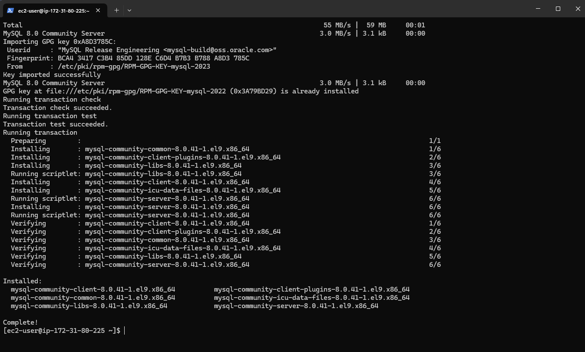
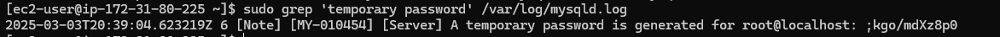
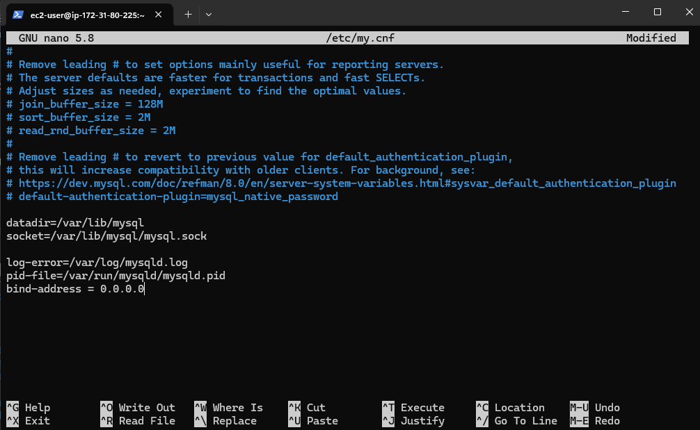
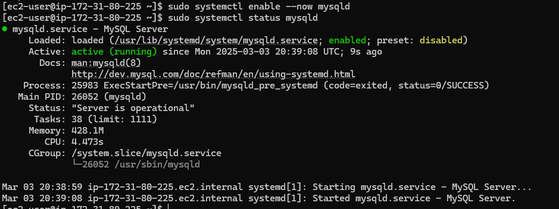
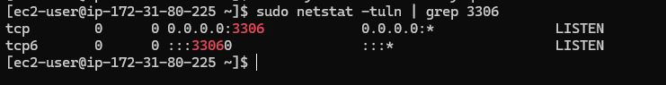
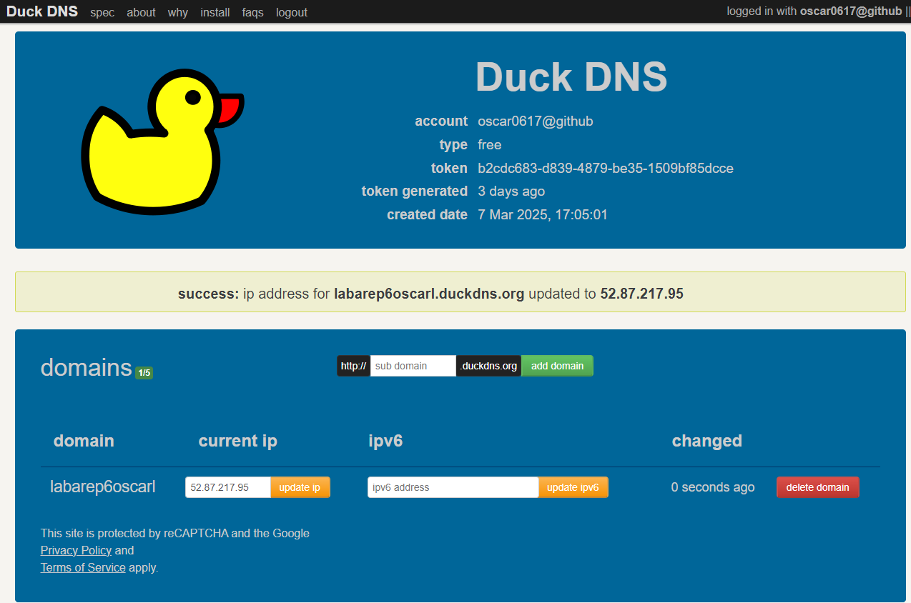
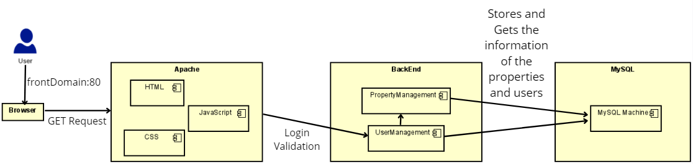
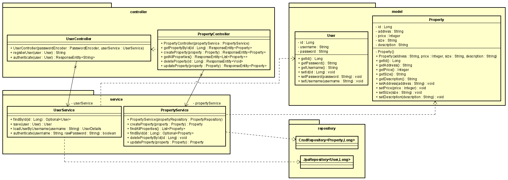
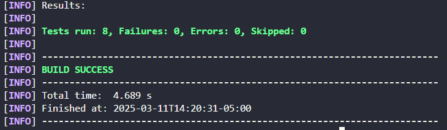

# Property Management System
 
This project implements a simple CRUD (Create, Read, Update, Delete) system for managing real estate properties using a Spring Boot backend and MySQL database and a frontend built with HTML, CSS, and JavaScript. It allows users to create, update, delete properties. Using HTTPS and TLS for secure communication between the backend and frontend.


## Getting Started

These instructions will get you a copy of the project up and running on your local machine for development and testing purposes.

### Prerequisites

You need to install the following tools to run the project:
1. Java
    ```
    java -version
    ```
    It should appear something like this:
    ```
    java version "17.0.10" 2024-01-16 LTS
    Java(TM) SE Runtime Environment (build 17.0.10+11-LTS-240)
    Java HotSpot(TM) 64-Bit Server VM (build 17.0.10+11-LTS-240, mixed mode, sharing)
    ```
    ```
    javac -version
    ```
    It should appear something like this:
    ```
    javac 17.0.10
    ```
2. Maven
    ```
    mvn -version
    ```
    It should appear something like this:
    ```
    Apache Maven 3.9.6 (bc0240f3c744dd6b6ec2920b3cd08dcc295161ae)
    Maven home: C:\workspace\apache-maven-3.9.6-bin\apache-maven-3.9.6
    Java version: 17.0.10, vendor: Oracle Corporation, runtime: C:\Program Files\Java\jdk-17
    Default locale: es_CO, platform encoding: Cp1252
    OS name: "windows 11", version: "10.0", arch: "amd64", family: "windows"
    ```
3. Git
    ```
    git --version
    ```
    It should appear something like this:
    ```
    git version 2.44.0
    ```
4. Docker
    ```
    docker --version
    ```
    It should appear something like this:
    ```
    Docker version 27.3.1, build ce12230
    ```

### Installing locally

1. Clone this repository and go to project directory:
    ```
    git clone https://github.com/oscar0617/Lab06-AREP-SecureApplication

    cd Lab06-AREP-SecureApplication
    ```
2. Build the project:
    ```
    mvn package
    ```
    Should appear something like this:
    ```
    
    ```
3. Run the container with MySQL
    ```
    docker-compose up -d
    ```
4. Run the project:
    ```
    mvn spring-boot:run
    ```
    Should appear something like this:
    ```
    
    ```
After this, you will be able to access into your browser with https://localhost:5000 and try the CRUD System with a data base locally, to do it with a MySQL data base follow the next section to deploy it on AWS. Check this video of the project working locally:


### Installing on AWS

Keep in mind that you will need an active AWS account to run this project on cloud.

#### MySQL Machine

1. Create an EC2 instance on AWS to host MySQL databse using Amazon Linux as the OS.

2. Connect to the EC2 instance:

```
ssh -i your-key.pem ec2-user@<mysql-ec2-instance-ip>
```

3. Install MySQL
```
wget https://dev.mysql.com/get/mysql80-community-release-el9-1.noarch.rpm
sudo rpm -Uvh mysql80-community-release-el9-1.noarch.rpm
sudo yum update -y
sudo yum install -y mysql-community-server
```
You should see something like this:


4. Start MySQL
```
sudo systemctl enable --now mysqld
sudo systemctl status mysqld
```
5. Get the temporal password of MySQL
```
sudo grep 'temporary password' /var/log/mysqld.log
```
6. Connect into MySQL using this password
```
mysql -u root -p
```

7. Create the database and user:
```
CREATE DATABASE crudsystem;
CREATE USER 'myuser'@'%' IDENTIFIED BY 'Password123!';
GRANT ALL PRIVILEGES ON crudsystem.* TO 'myuser'@'%';
FLUSH PRIVILEGES;
```
8. Allow external connections to MySQL by editing the MySQL config file:
```
sudo nano /etc/my.cnf
```
9. Add the following line at the bottom of the file:
```
bind-address = 0.0.0.0
```
Follow this example:

10. Restart MySQL:
```
sudo systemctl restart mysqld
```
11. Verify the MySQL status


12. Check the listening port


And that's it, we finished setting up our MySQL instance on EC2. Now let's set up the Backend instance.

#### Domain (Duck DNS)

To use a valid certificate we need a domain, otherwise this will not work. So to solve this, we are going to use duckdns.org.

1. Go to duckdns.org and use your GitHub account or create a new one.

2. Create a subdomain for each EC2 instances (front end and backend)

3. Update the DNS with the IP address of each of your EC2 instances.



#### Apache server
In a different EC2 instance:

1. Install Apache:
    ```
    sudo yum install httpd -y
    sudo systemctl start httpd
    sudo systemctl enable httpd
    ```

2. Set up HTTPS:
    Install Certbot and configure Apache to serve content over HTTPS:
    ```
    sudo yum install certbot python3-certbot-apache -y
    sudo certbot certonly --standalone -d <DOMAIN>
    ```
    This will automatically configure Apache to use the certificate.

3. Edit the Apache VirtualHost configuration:
    ```
    sudo nano /etc/httpd/conf.d/serverfront.conf
    ```

4. Add the following configuration:
    ```
      <VirtualHost *:80>
        ServerName labarep6oscarl.duckdns.org
        DocumentRoot /var/www/html

        ErrorLog /var/log/httpd/labarep6oscarl_error.log
        CustomLog /var/log/httpd/labarep6oscarl_access.log combined
      </VirtualHost>

      <VirtualHost *:443>
          ServerName labarep6oscarl.duckdns.org
          DocumentRoot /var/www/html

          SSLEngine on
          SSLCertificateFile /etc/letsencrypt/live/labarep6oscarl.duckdns.org/fullchain.pem
          SSLCertificateKeyFile /etc/letsencrypt/live/labarep6oscarl.duckdns.org/privkey.pem

          ErrorLog /var/log/httpd/labarep6oscarl_error_ssl.log
          CustomLog /var/log/httpd/labarep6oscarl_access_ssl.log combined
      </VirtualHost>
    ```

5. Restart Apache to apply changes:
    ```
    sudo systemctl restart httpd
    ```

6. Deploy frontend files:
    Copy your frontend files (HTML, CSS, JS) to `/var/www/html`
    ```
    sudo cp -r /path/to/your/frontend/* /var/www/html/
    ```

7. Ensure the firewall allows HTTPS traffic:
    Ensure that port `443` is open for the Apache server in the AWS Security Group.

8. Apply SSL on Apache:

  ```
  sudo certbot certonly --manual --preferred-challenges dns -d <DOMAIN>
  ```
  And renew the certificate.

9. Restart Apache:
  ```
    sudo systemctl restart httpd
  ```


#### Prerrequisites on the backend for AWS

Before we proceed, we have to make some changes on our settings and code in our backend, to run the application in AWS.

1. In application properties you must add this code:
```
spring.datasource.url=jdbc:mysql://<MySQL IPAddress>:3306/crudsystem
spring.datasource.username=myuser
spring.datasource.password=<passwordOfTheUser>
spring.datasource.driver-class-name=com.mysql.cj.jdbc.Driver
spring.jpa.database-platform=org.hibernate.dialect.MySQL8Dialect
spring.jpa.hibernate.ddl-auto=update
spring.jpa.show-sql=true
```
This code connects into the MySQL Instance to use it as database

Also we need to establish the p12 key in the application properties (Be careful with the alias and password of the .p12 file):
```
server.ssl.key-store-type=PKCS12
server.ssl.key-store=/home/ec2-user/keystore.p12
server.ssl.key-store-password=123456
server.ssl.key-alias=labarep6oscarl
server.ssl.enabled=true
```
We are going to set up this later in the backend EC2 instance

2. In `script.js` you need to change this line
```
let IPADDRESS = "domain of the backend";
```

3. In the controllers `controller/` we have to set the CORS configuration to accept request from the frontend:
```
@CrossOrigin(origins = "https://domainFrontend", allowCredentials = "true")
@RestController
@RequestMapping("/v1/property")
public class PropertyController 

@CrossOrigin(origins = "https://domainFrontend", allowCredentials = "true")
@RestController
@RequestMapping("/users")
public class UserController
```

4. Also we need to configure the security in `config/` (both files):
```
SecurityConfiguration.java
@Bean
    public CorsFilter corsFilter() {
        UrlBasedCorsConfigurationSource source = new UrlBasedCorsConfigurationSource();
        CorsConfiguration config = new CorsConfiguration();
        config.setAllowCredentials(true);
        config.setAllowedOrigins(Arrays.asList("https://domainFront"));
        config.setAllowedMethods(Arrays.asList("GET", "POST", "PUT", "DELETE", "OPTIONS"));
        config.setAllowedHeaders(Arrays.asList("Authorization", "Content-Type")); 
        source.registerCorsConfiguration("/**", config);
        return new CorsFilter(source);
    }
```

```
WebConfiguration.java
@Override
    public void addCorsMappings(CorsRegistry registry) {
        registry.addMapping("/**")
                .allowedOrigins("https://domainFront")
                .allowedMethods("GET", "POST", "PUT", "DELETE", "OPTIONS")
                .allowedHeaders("*")
                .allowCredentials(true);
    }
```

NOTE: Be careful, if you put the IP addresses the app will not work due the certificate. Make sure to place the Domain with the valid certificate.

With this steps you will be able to deploy the backend on AWS

#### Backend on AWS

1. Create another EC2 instance for the backend and connect to it via SSH
```
ssh -i your-key.pem ec2-user@<backend-ec2-instance-ip>
```

2. Install Java and Maven:

```
sudo yum install java-17-amazon-corretto -y
sudo yum install maven -y
```

3. Request a certificate for the backend:

```
sudo certbot certonly --standalone -d <BackEnd Domain>
```

4. Transform the certificate to a `.p12` file to make it compatible with springboot:
```
sudo openssl pkcs12 -export -in /etc/letsencrypt/live/<BACKEND DOMAIN>/fullchain.pem -inkey /etc/letsencrypt/live/<BACKEND DOMAIN>/privkey.pem -out /etc/letsencrypt/live/<BACKEND DOMAIN>/keystore.p12 -name <ALIAS> -password pass:123456 

sudo ls -lah /etc/letsencrypt/live/<BACKEND DOMAIN>/ sudo mv /etc/letsencrypt/live/<BACKEND DOMAIN>/keystore.p12 /home/ec2-user/ sudo chmod 644 /home/ec2-user/keystore.p12
```
5. Move the `.p12` file to an accessible directory:
```
sudo mv /etc/letsencrypt/live/backendoscar.duckdns.org/keystore.p12 /home/ec2-user/

sudo chmod 644 /home/ec2-user/keystore.p12

```
6. In the section described before in the application properties make changes if you need it.

7. Transfer the JAR file to the EC2 instance using SFTP (keep in mind that you must to compile and package the jar file before this step in you local machine):
```
sftp -i your-key.pem ec2-user@<backend-ec2-instance-ip>

put target/arep-0.0.1-SNAPSHOT.jar
```

8. Run the application using Spring-boot
```
java -jar arep-0.0.1-SNAPSHOT.jar
```

To access to the application don't forget to open the ports on the IAM of AWS, otherwise the connection will be rejected, same for MySQL instance.

Let's see the application running in AWS:


## Architecture



#### Overview

This architecture diagram illustrates the request flow in the **Real Estate CRUD System**. The system is divided into four main components:

1. **Browser (Client)**
2. **Apache (Frontend Server)**
3. **Backend (Spring Boot Application)**
4. **Database (MySQL)**

#### **Components and Workflow**

#### **Browser (Client)**
The **user** interacts with the system through a **web browser**, which:
- Sends **HTTP requests** to `frontDomain:80` (Apache Server).
- Requests **static files** such as:
  - **HTML** (for page structure).
  - **JavaScript** (for dynamic interactions).
  - **CSS** (for styling).
- Uses **JavaScript** to send API requests for **login validation** and **CRUD operations** on properties.

#### **Apache (Frontend Server)**
The **Apache server** acts as the frontend layer, responsible for:
- Serving **static web content** (HTML, CSS, JavaScript).
- Handling **user requests** for page rendering.
- Redirecting API requests (e.g., login validation, property management) to the backend.

#### **Backend (Spring Boot Application)**
The backend is a **Spring Boot application** that:
- Processes **authentication and authorization**.
- Manages **user accounts** via the `UserManagement` module.
- Manages **property listings** via the `PropertyManagement` module.
- Exposes **RESTful API endpoints** for CRUD operations.
- Communicates with the **MySQL database** to retrieve and store information.

#### **Database (MySQL)**
The database is a **MySQL instance** responsible for:
- Storing and retrieving **user credentials**.
- Managing **property data**.
- Handling queries related to **creating, reading, updating, and deleting** records.

#### **Request Flow**

1. The **user** sends an **HTTP request** from the **browser** to `frontDomain:80` (Apache Server).
2. If the request is for a **static file** (HTML, CSS, JavaScript), Apache serves it directly.
3. If the request requires **backend processing** (e.g., login validation, CRUD operations), Apache forwards it to the **Spring Boot backend**.
4. The backend:
   - Processes **authentication requests** via `UserManagement`.
   - Processes **property-related requests** via `PropertyManagement`.
   - Queries the **MySQL database** for necessary information.
5. The **MySQL database** sends the requested data back to the **backend**.
6. The **backend** processes the data and responds to the **Apache server**.
7. The **Apache server** sends the response to the **browser**, updating the UI dynamically.


## Class Diagram


#### Overview

The class diagram represents the Real Estate CRUD System, showing its main components, relationships, and responsibilities. 

1. **`Model`** - Defines the `User` and `Property` entities.
2. **`Repository & Service`** - Handles database operations and business logic.
3. **`Controller`** - Manages HTTP requests and responses.

#### **Model Layer**
This layer contains the domain entities: `User` and `Property`.

#### **User Class**
Represents an application user with login credentials.

- **Attributes**:
  - `id: Long` → Unique identifier of the user.
  - `username: String` → User's login name.
  - `password: String` → User's password.

- **Methods**:
  - `getId() : Long` → Returns the user ID.
  - `getPassword() : String` → Returns the user's password.
  - `getUsername() : String` → Returns the username.
  - `setId(id: Long) : void` → Sets the user ID.
  - `setPassword(password: String) : void` → Updates the password.
  - `setUsername(username: String) : void` → Updates the username.

#### **Property Class**
Represents a real estate entity with attributes:

- **Attributes**:
  - `id: Long` → Unique identifier of the property.
  - `address: String` → Property location.
  - `price: Integer` → Property price.
  - `size: String` → Property size.
  - `description: String` → Additional property details.

- **Methods**:
  - `getId() : Long` → Returns the property ID.
  - `getAddress() : String` → Returns the address.
  - `getPrice() : Integer` → Returns the price.
  - `getSize() : String` → Returns the size.
  - `getDescription() : String` → Returns the description.
  - `setAddress(address: String) : void` → Sets a new address.
  - `setPrice(price: Integer) : void` → Updates the price.
  - `setSize(size: String) : void` → Updates the size.
  - `setDescription(description: String) : void` → Updates the description.


#### **Repository Layer**
The repository layer abstracts database persistence using Spring Data JPA.

#### **Repositories**
- `CrudRepository<Property, Long>` → Handles CRUD operations for `Property`.
- `JpaRepository<User, Long>` → Handles CRUD operations for `User`.

- **Methods**:
  - `findById(id: Long) : Optional<Property>` → Retrieves a property by its ID.
  - `findAll() : List<Property>` → Fetches all properties.

This layer ensures database interactions are handled efficiently.

#### **Service Layer**
The service layer implements business logic for managing users and properties.

#### **UserService**
Handles authentication and user management.

- **Methods**:
  - `findById(id: Long) : Optional<User>` → Retrieves a user by ID.
  - `save(user: User) : User` → Saves a new user.
  - `loadUserByUsername(username : String) : UserDetails` → Loads user by username.
  - `authenticate(username : String, rawPassword : String) : boolean` → Validates user credentials.

#### **PropertyService**
Implements the logic for managing properties.

- **Methods**:
  - `createProperty(property: Property) : Property` → Saves a new property.
  - `findAllProperties() : List<Property>` → Returns all properties.
  - `findById(id: Long) : Optional<Property>` → Fetches a property by ID.
  - `deletePropertyById(id: Long) : void` → Deletes a property.
  - `updateProperty(property: Property) : Property` → Updates an existing property.

This layer ensures data validation, processing, and interaction with the repository.


#### **Controller Layer**
The controller layer handles **HTTP requests** and interacts with the service layer.

#### **UserController**
Manages user authentication and registration.

- **Methods**:
  - `registerUser(user: User) : String` → Registers a new user.
  - `authenticate(user: User) : ResponseEntity<String>` → Authenticates user credentials.

#### **PropertyController**
Handles property-related requests.

- **Methods**:
  - `@GetMapping("/{id}")`
    - **Description**: Fetches a property by ID.
    - **Returns**: `ResponseEntity<Property>`.

  - `@PostMapping("/create")`
    - **Description**: Creates a new property.
    - **Returns**: `ResponseEntity<Property>` with status `201 CREATED`.

  - `@GetMapping`
    - **Description**: Retrieves all properties.
    - **Returns**: `ResponseEntity<List<Property>>`.

  - `@DeleteMapping("/{id}")`
    - **Description**: Deletes a property by ID.
    - **Returns**: `ResponseEntity<Void>` with `204 NO CONTENT` or `404 NOT FOUND`.

  - `@PutMapping("/update")`
    - **Description**: Updates an existing property.
    - **Returns**: `ResponseEntity<Property>` with `200 OK` or `404 NOT FOUND`.

This layer acts as the REST API interface, exposing endpoints for client interactions.

#### **Relationships and Interactions**
- **Model → Repository**
  - The `User` and `Property` classes are mapped to the database using JPA.

- **Repository → Service**
  - The `UserRepository` and `PropertyRepository` are used by their respective services to fetch and manage data.

- **Service → Controller**
  - The `UserService` and `PropertyService` handle business logic before sending data to their controllers.

- **Controller → API**
  - The `UserController` and `PropertyController` expose RESTful endpoints for external applications to interact with the system.


## Running the tests

The following unit tests were created to validate the functionality of the `PropertyController` class. These tests ensure that each endpoint of the REST API behaves as expected.

#### **1. `testGetPropertyById_WhenPropertyExists`**
- **Purpose**: Validates that the `/v1/property/{id}` endpoint returns a property when it exists.
- **What it tests**:
  - Given an existing property ID, the controller should return a `200 OK` response.
  - The returned property should match the requested ID and have the correct address.


#### **2. `testGetPropertyById_WhenPropertyDoesNotExist`**
- **Purpose**: Ensures that requesting a non-existent property ID returns `404 NOT FOUND`.
- **What it tests**:
  - When a property is not found, the response should have no body and return `404 NOT FOUND`.


#### **3. `testCreateProperty`**
- **Purpose**: Validates the `/v1/property/create` endpoint to ensure that new properties can be created successfully.
- **What it tests**:
  - Given a valid property object, the system should return `201 CREATED` and persist the property.
  - The returned property should match the provided data.


#### **4. `testGetAllProperties`**
- **Purpose**: Ensures that the `/v1/property` endpoint retrieves all stored properties.
- **What it tests**:
  - The API should return `200 OK` with a list of properties.
  - The number of returned properties should match the expected count.

#### **5. `testDeleteProperty_WhenExists`**
- **Purpose**: Validates that an existing property can be deleted using the `/v1/property/{id}` endpoint.
- **What it tests**:
  - Given an existing property ID, the API should return `204 NO CONTENT` after deletion.
  - The property should no longer exist in the system.


#### **6. `testDeleteProperty_WhenNotExists`**
- **Purpose**: Ensures that trying to delete a non-existent property results in a `404 NOT FOUND` response.
- **What it tests**:
  - When a property with the given ID does not exist, the API should return `404 NOT FOUND`.

#### **7. `testUpdateProperty_WhenExists`**
- **Purpose**: Validates that an existing property can be updated using the `/v1/property/update` endpoint.
- **What it tests**:
  - Given a valid property ID and updated data, the API should return `200 OK`.
  - The updated property should reflect the changes.

#### **8. `testUpdateProperty_WhenNotExists`**
- **Purpose**: Ensures that trying to update a non-existent property results in a `404 NOT FOUND` response.
- **What it tests**:
  - When a property does not exist, the API should return `404 NOT FOUND`.
  - No changes should be made in the database.

### **Test Execution**
Each of the tests was executed using **JUnit 5** and **Mockito** to mock dependencies and isolate the `PropertyController`. The expected outcomes were met in all cases, validating the correctness of the CRUD operations.




## Conclusion

The Real Estate CRUD System provides a well-structured and scalable solution for managing property listings. Built with Spring Boot, it follows a layered architecture ensuring separation of concerns between the controller, service, and repository layers. Ensuring secure communication between the frontend and backend using TLS and HTTPS.

## Built With

* [Maven](https://maven.apache.org/) - Dependency Management
* [GIT](https://git-scm.com) - Version control
* [Spring-boot](https://spring.io/projects/spring-boot) - Backend framework
* [MySQL](https://www.mysql.com) - Database
* [Docker](https://www.docker.com) - Virtualization
* [DuckDNS](https://duckdns.org) - DNS service

## Versioning

I use [GitHub](http://github.com) for versioning.

## Authors

* **Oscar Santiago Lesmes Parra** - [oscar0617](https://github.com/oscar0617)

Date: 11/03/2025
## License

This project is licensed under the GNU.
